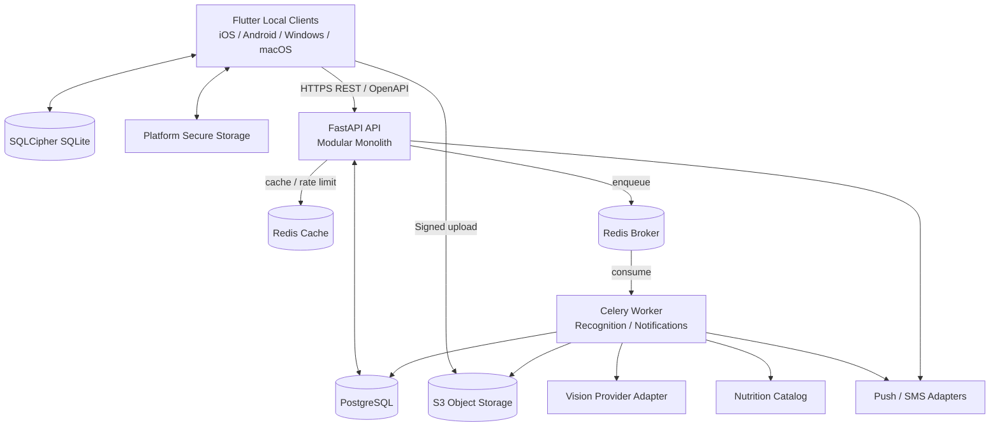
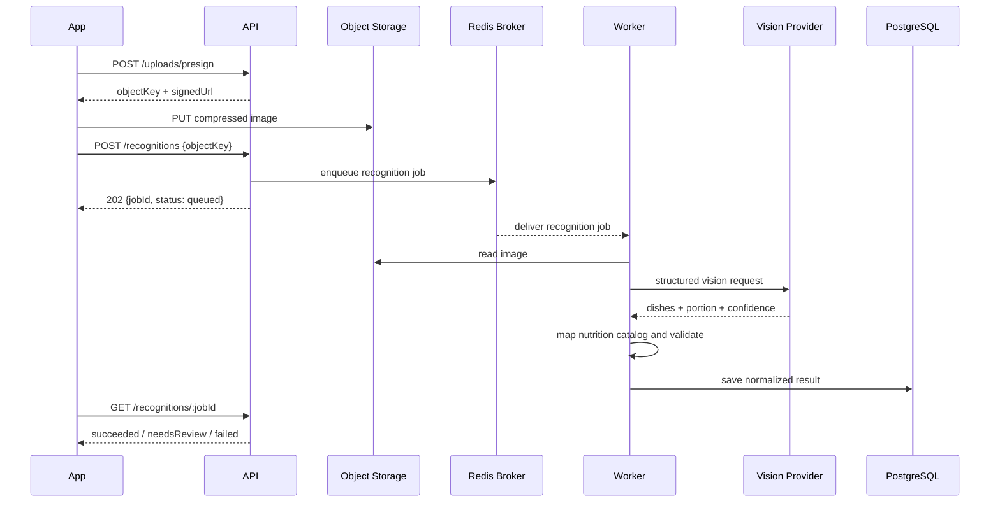

# 饮食生活 App · 系统架构与技术选型

| 项目 | 内容 |
|---|---|
| 文档版本 | v1.2 |
| 日期 | 2026-07-20 |
| 状态 | 推荐方案，可进入工程初始化 |
| 对应需求 | `饮食生活App_需求设计文档PRD.md` v1.0 |
| 首要平台 | iOS / Android 本地 App，后续 Windows / macOS 本地客户端 |

---

## 1. 结论摘要

### 1.1 推荐技术栈

| 层级 | 选择 | 版本基线 | 说明 |
|---|---|---|---|
| 客户端 | Flutter + Dart | Flutter 3.44 stable / 配套 Dart stable | 同一工程生成 iOS、Android、Windows、macOS 本地安装包，不运行在浏览器或 WebView 中 |
| 路由 | `go_router` | 17.x | 类型化路由、Deep Link、移动与桌面导航装配 |
| UI | Flutter Widgets + 设计令牌 | 跟随 Flutter stable | 不引入重量级 UI 套件，移动端和 PC 端分别布局，共享组件与视觉令牌 |
| 自适应布局 | `LayoutBuilder` + `MediaQuery` + 平台导航组件 | Flutter SDK 内置 | 手机使用底部导航，PC 使用侧边栏和多栏布局，禁止简单等比拉伸手机页面 |
| 状态与依赖注入 | Riverpod | 3.x | 异步状态、依赖注入、缓存和可测试业务状态 |
| 网络 | Dio + OpenAPI 生成客户端 | 锁定安装时稳定版 | 统一拦截器、重试、Token 轮换和类型化 API |
| 数据模型 | Freezed + `json_serializable` | 锁定安装时稳定版 | 不可变模型、联合状态和 JSON 序列化 |
| 本地持久化 | Drift + SQLite + SQLCipher | 锁定安装时稳定版 | Android、iOS、Windows、macOS 共用离线模型、迁移与同步队列 |
| 安全存储 | 平台安全存储适配器 | 锁定安装时稳定版 | 对接 Keychain、Keystore、Windows Credential Locker 等平台能力 |
| 后端 | Python + `FastAPI[standard]` + Uvicorn | CPython 3.14.6 / FastAPI `>=0.139.2,<0.140` | 使用标准 GIL 构建的 ASGI 模块化单体；异步 I/O 处理业务 API，并与图像处理、模型评测和未来推理共用 Python 生态 |
| API | REST + OpenAPI 3.x | `/api/v1` | 由后端生成 OpenAPI，再生成 Dart API 客户端 |
| 数据校验与配置 | Pydantic 2 + `pydantic-settings` | 2.x | 请求响应校验、供应商结构化输出校验和类型化环境配置 |
| 服务端 ORM | SQLAlchemy 2 + Alembic + psycopg 3 | SQLAlchemy `>=2.0.51,<2.1` / Alembic `>=1.18.5,<1.19` | ORM、事务边界、PostgreSQL 驱动和可审计数据库迁移 |
| 主数据库 | PostgreSQL | 18.x，使用当前最新小版本 | 用户、菜谱、饮食、断食和社交关系的服务端事实源 |
| 缓存与队列 | Redis Broker + Redis Cache + Celery | `celery[redis]>=5.6.3,<5.7` / 托管 Redis 稳定版 | 生产环境分离 broker 与可淘汰缓存；Celery Worker 处理识别与通知任务，业务任务状态写入 PostgreSQL |
| 图片存储 | S3 兼容对象存储 + CDN | 云厂商托管 | 客户端直传，后端只签发短时上传凭证 |
| AI 识别 | 多模态模型 API + Python 图像处理 + 营养数据库 | 供应商适配层 | V1 不自训练模型；图像预处理、视觉识别、模型评测与营养计算分离 |
| 监控 | Sentry Flutter/Python + OpenTelemetry + structlog | 锁定安装时稳定版 | 客户端崩溃、服务端链路、结构化 JSON 日志和业务指标 |
| 工程 | Git monorepo + Melos + uv | Flutter / Python 双工具链；CI 固定 uv 0.11.x 补丁版本 | Melos 管理 Dart 包，uv 管理 Python 环境、依赖锁定、API 与 Worker |
| CI/CD | GitHub Actions + Flutter 原生构建 + Docker | 托管服务 | 自动检查 Android/iOS/Windows/macOS 构建、服务端镜像和数据库迁移 |

### 1.2 核心架构决策

1. **客户端采用 Flutter 本地应用，移动端优先但不牺牲桌面能力。** V1 发布 iOS、Android，同时让 Windows 构建在 CI 中持续可用；PC 功能后续按桌面交互重新布局。
2. **主后端使用 Python/FastAPI。** 选择依据不是 Node.js 性能不足，而是 Flutter 已不存在共享 TypeScript 的收益，图片预处理、识别评测和未来推理均以 Python 生态为主；保持 Dart + Python 两种主语言可降低长期复杂度。
3. **V1 使用模块化单体，不拆微服务。** API 与 Worker 可分别部署，但共享同一套领域代码和数据库。
4. **离线关键功能以本地数据库为事实源。** 随机推荐、断食计时和新增饮食记录无网可用，联网后通过 Outbox 同步。
5. **图片识别采用异步任务。** App 直传对象存储，后端创建识别任务，Worker 调用模型并写回结构化结果。
6. **AI 不直接决定最终热量。** 模型负责识别候选菜品和份量，营养服务用受控数据表计算，低置信度必须允许用户修正。
7. **服务端保持云厂商中立。** 短信、对象存储、AI、推送都通过适配器接入，部署地区确定后再选择供应商。
8. **健康数据默认最小化。** 图片去除 EXIF，原图默认短期保留，本地数据库加密，日志不得记录健康明细。

### 1.3 明确不选

| 方案 | 当前不选原因 |
|---|---|
| Expo / React Native | 它是原生移动 App 技术，不是 Web；但 Expo 不直接覆盖 Windows/macOS，后期 PC 端会形成另一套运行时和 UI 工程 |
| React Native Windows/macOS | 可以生成原生桌面应用，但与当前移动端 React Native 版本存在跟进差，第三方原生模块的桌面实现也不完整，长期升级成本更高 |
| Electron / Tauri | 都能生成本地桌面安装包，但 UI 基于浏览器引擎或系统 WebView，并且需要与移动端维护两套界面；当前没有必要引入 |
| Web / PWA 作为主客户端 | 后台计时、系统通知、相机、文件、本地加密和商店分发体验均不符合“本地 App 优先”定位 |
| iOS/Android 双原生 | MVP 开发和维护成本约为跨端方案的两套，不符合当前阶段 |
| 纯 Firebase/Supabase 后端 | 推荐、断食联动、识别任务和后续社交规则会快速分散到函数、触发器与权限规则中，不利于领域维护 |
| Node.js / NestJS 作为主后端 | 业务 API 能力足够，但 Flutter 已消除前后端共享 TypeScript 的收益；识别能力进入图像预处理、评测或自有推理后仍需 Python，会形成 Dart + TypeScript + Python 三语言栈 |
| Go 作为主后端 | 并发和部署效率优秀，但当前瓶颈不是 API CPU 性能，AI/图像生态较弱，后续仍大概率增加 Python 服务 |
| GraphQL | 当前业务以资源 CRUD、同步和异步任务为主，REST + OpenAPI 更简单，也更适合生成客户端和排障 |
| 微服务 / Kubernetes | 当前没有独立团队、独立扩容和高吞吐证据，先拆会增加部署、事务和观测成本 |
| 端侧 AI 模型 | 包体、耗电、机型兼容和中文菜品精度风险高；V1 先通过云端模型验证数据和交互闭环 |

### 1.4 “本地 App”的技术边界

- Android 产出 AAB/APK，iOS 产出 IPA，Windows 产出 EXE/MSIX，macOS 产出签名 App 安装包。
- 客户端启动和渲染不需要浏览器，也不依赖启动一个本地 Web 服务器。
- Flutter 使用自己的渲染与平台嵌入层，不把页面装进 WebView。
- 使用 REST API 不会让客户端变成 Web 应用；同步、AI、好友等联网能力仍然需要后端。
- 随机推荐、断食计时、已缓存菜谱和本地记录在断网时继续工作，联网后再同步。

---

## 2. 选型前提与边界

本方案基于以下前提：

- 第一阶段是 1–4 人团队建设 MVP，优先验证“吃什么、拍照记录、断食坚持”闭环。
- PC 端按普通用户使用的本地客户端规划，不是后台管理网页；Windows 优先，macOS 保持可构建。
- V1.0 包含吃什么、居家推荐、菜谱详情、拍照识别、饮食记录、断食计时和个人资料。
- V1.5 的好友、排行、组队、购物清单预留模块和数据边界，但不阻塞 V1.0 上线。
- 识别依赖联网；随机推荐、断食计时和本地记录必须无网可用。
- 目标市场和部署地区尚未锁定，因此不在此时绑定短信、云存储和 AI 厂商。
- 本产品属于健康生活工具，不提供医疗诊断；营养值必须标注为估算并支持人工修正。
- Flutter 3.44 的兼容基线为 Android API 24+、iOS 13+、Windows 10/11、macOS 10.15+。

以下变化会触发重新评估：

- PC 端实际只是内部运营后台，而不是普通用户客户端；这种情况应单独建设 React Web 后台，不影响 Flutter App。
- 团队已有成熟 React Native Windows/macOS 或四端原生开发能力，并愿意承担插件维护。
- V1 就要求 Apple Health、Health Connect 的深度双向同步或复杂端侧视觉处理。
- 需要在中国大陆部署并取得相关资质，或必须满足特定医疗数据合规要求。
- 日活和识别任务量出现需要独立伸缩、独立发布的真实证据。

---

## 3. 质量目标

| 指标 | 工程目标 |
|---|---|
| App 冷启动 | 中端设备 P75 ≤ 2.5 秒，首屏不依赖网络完成 |
| 外卖随机 | 本地目录命中时 P95 ≤ 150 毫秒，PRD 的 ≤1 秒要求留出充足余量 |
| 拍照提交反馈 | 点击后 300 毫秒内进入上传/识别状态 |
| 图片识别 | P50 ≤ 3 秒，P95 ≤ 8 秒；若 PRD 要求 P95 ≤ 3 秒，需单独评估模型与地区 SLA |
| API | 普通读请求 P95 ≤ 300 毫秒，普通写请求 P95 ≤ 500 毫秒，不含外部 AI 调用 |
| 离线 | 随机、断食、新增/修改饮食记录可离线完成，恢复联网后自动同步 |
| 可用性 | MVP 服务端月可用性目标 99.9% |
| 数据恢复 | PostgreSQL RPO ≤ 15 分钟，RTO ≤ 4 小时 |
| 稳定性 | 发布版本 crash-free sessions ≥ 99.5% |
| 无障碍 | 支持系统字号、屏幕阅读器标签、触控目标不小于 44×44 pt |

倒计时不能依赖 Dart 定时器持续在后台运行。客户端只持久化 `startedAt`、`targetEndAt`、模式和状态；每次回到前台根据当前时间重新计算，并用系统本地通知提醒关键节点。

---

## 4. 总体架构



### 4.1 运行单元

| 运行单元 | 职责 | 扩容方式 |
|---|---|---|
| `client` | Flutter UI、离线业务、本地通知、同步；移动端相机/相册，桌面端文件选择 | 移动商店、Microsoft Store、macOS 签名包分别发布 |
| `api` | 鉴权、领域 API、签名上传、查询、同步和任务创建 | 无状态水平扩容 |
| `worker` | 图片识别、通知、周报等异步任务 | 按队列深度独立扩容 |
| PostgreSQL | 交易数据和服务端事实源 | 托管实例、读副本按需要增加 |
| Redis Broker | Celery 消息队列 | 生产使用独立实例、持久化和 `noeviction`；按队列深度监控 |
| Redis Cache | 限流、验证码和短缓存 | 可独立淘汰和扩容，不与 broker 混用实例 |
| Object Storage | 用户图片和菜品静态资源 | 云厂商托管 + CDN |

`api` 与 `worker` 在代码上属于同一个系统，在部署上是两个进程。这样可以独立扩容识别任务，又不承担微服务的跨服务事务和版本治理成本。

---

## 5. Flutter 客户端架构

### 5.1 分层规则

```text
apps/client/
├─ lib/
│  ├─ main.dart
│  ├─ bootstrap/             # 环境、日志、数据库和依赖装配
│  ├─ app/                   # go_router、应用壳和全局主题
│  ├─ features/              # eat、meals、fasting、friends、profile
│  │  └─ <feature>/
│  │     ├─ application/     # 用例与 Riverpod providers
│  │     ├─ domain/          # 实体、值对象和仓库接口
│  │     ├─ data/            # API、Drift 与仓库实现
│  │     └─ presentation/    # mobile、desktop 和共享 widgets
│  ├─ core/
│  │  ├─ api/                # OpenAPI 生成客户端的封装
│  │  ├─ db/                 # Drift、迁移和 SQLCipher
│  │  ├─ sync/               # Outbox 与增量同步
│  │  ├─ security/           # 平台安全存储适配器
│  │  ├─ platform/           # 相机、文件、通知和窗口能力
│  │  ├─ theme/              # 设计令牌
│  │  └─ telemetry/
│  └─ shared/widgets/
├─ assets/
├─ android/  ios/            # V1 发布目标
├─ windows/  macos/          # 从第一天保持可构建
├─ test/
└─ integration_test/
```

约束：

- 页面和路由不直接访问数据库或拼装 HTTP 请求。
- 功能模块只能通过公开接口访问其他模块，不能跨目录读取内部实现。
- 颜色、字号、间距、圆角、阴影和动效时长全部来自设计令牌。
- Riverpod Provider 按功能模块声明；Widget 不保存可持久化业务状态。
- 离线关键记录由 Drift/SQLite 管理，网络仓库负责同步，UI 不直接判断网络分支。
- Token 和数据库密钥通过安全存储接口进入 Keychain、Keystore 或 Windows Credential Locker，不进入普通偏好存储。
- OpenAPI 是 Dart 客户端 DTO 的唯一来源，业务层不得直接依赖生成 DTO。
- 平台差异通过 `CameraService`、`FilePickerService`、`NotificationService`、`WindowService` 等接口隔离。

### 5.2 移动端与 PC 端布局策略

同一套代码不代表把手机页面放大到 PC。共享的是领域逻辑、数据、设计令牌和基础组件，页面组合按窗口能力分别实现。

| 窗口类型 | 导航与布局 | 主要交互 |
|---|---|---|
| Compact `<600dp` | 底部导航、单列页面、底部抽屉 | 触摸优先，拍照入口突出 |
| Medium `600–1023dp` | NavigationRail、主从布局 | 平板与小窗口，支持键鼠和触摸 |
| Expanded `≥1024dp` | 固定侧栏、双栏/三栏、常驻详情 | 键盘快捷键、右键菜单、Hover、拖放文件 |

平台能力约定：

- Android/iOS 使用相机和相册；Windows/macOS 默认使用文件选择与拖放，也可在插件验证后接摄像头。
- 移动端使用底部导航，PC 端使用侧边导航；业务路由名称和 Deep Link 保持一致。
- PC 端窗口可缩放，但固定格式控件必须使用明确的最小/最大尺寸，不能随窗口任意拉伸。
- PC 端首期不实现移动端所有功能；先复用资料、统计、菜谱、饮食记录和断食历史，再评估实时计时与通知。
- 每次新增 Flutter 插件，都必须在 Android、iOS、Windows、macOS 四个平台检查支持状态；缺失平台实现时通过适配器降级，不能污染领域层。

### 5.3 离线数据范围

| 数据 | 本地策略 | 同步策略 |
|---|---|---|
| 菜品基础目录 | 随 App 内置最小版本，联网增量更新 | 服务端发布 `catalogVersion` |
| 随机会话 | 只存本地短期历史，避免本次会话重复 | 无需上传或仅做匿名分析 |
| 饮食记录 | SQLite 立即写入 | Outbox 至少一次提交，服务端按幂等键去重 |
| 断食会话 | SQLite 为离线期间事实源 | 使用设备生成 UUID，联网后合并 |
| 用户资料 | 本地缓存 | 服务端 `version` 做乐观并发控制 |
| 识别任务 | 本地保留任务状态 | 必须联网；失败可重试或转手动记录 |
| 好友动态 | 网络优先，本地只缓存 | 不支持离线写入，V1.5 实现 |

### 5.4 同步机制

本地写入和 Outbox 必须在同一个 SQLite 事务内完成：

1. 用户操作写入业务表。
2. 同事务写入 `sync_outbox`，包含 `operationId`、实体、动作、载荷版本和创建时间。
3. 网络恢复后按创建顺序批量提交 `/api/v1/sync/push`。
4. 服务端用 `operationId` 保证幂等，返回服务端版本和冲突结果。
5. App 拉取 `/api/v1/sync/pull?cursor=...` 并更新本地游标。

冲突规则：

- 饮食和断食日志以追加为主，修改使用实体 `version`，删除使用 tombstone。
- 用户资料采用乐观锁；冲突时以字段级最新时间合并，无法安全合并则提示用户。
- 排行、好友状态和订阅权益始终以服务端为准。

---

## 6. 后端模块边界

以下是领域模块子树；FastAPI 与 Celery 的进程入口见第 10 节仓库结构。

```text
server/src/ordin/
├─ modules/
│  ├─ auth/              # OTP、会话、设备、第三方登录适配器
│  ├─ users/             # 账号基本信息
│  ├─ health_profile/    # 身高、体重、目标、过敏和热量目标
│  ├─ catalog/           # 菜品、食材、营养和菜谱
│  ├─ recommendation/    # 外卖随机、居家推荐和去重规则
│  ├─ meals/             # 饮食记录和每日汇总
│  ├─ fasting/           # 计划、会话、完成判定和 streak
│  ├─ recognition/       # 上传、任务、结构化结果和人工修正
│  ├─ lists/             # 想吃与购物清单，V1.5
│  ├─ social/            # 好友、互动、排行和组队，V1.5
│  ├─ notifications/     # 本地以外的推送、短信和通知偏好
│  ├─ subscriptions/     # 会员与权益，V2
│  └─ sync/              # 多端客户端增量同步与幂等
└─ infrastructure/       # 数据库、队列、存储、日志和配置
```

服务端使用 `pyproject.toml` 与 `uv.lock` 固定 Python 和依赖版本，采用 `src` layout。运行时固定 CPython 3.14.6 标准 GIL 构建，不采用 free-threaded `3.14t`。业务代码必须有完整类型标注，并通过 Ruff 与 mypy strict 检查；FastAPI 路由、Celery 任务、领域逻辑和 ORM 持久化必须分层。阻塞式图片处理或 CPU 密集计算不得直接运行在 FastAPI 事件循环中，统一提交到 Worker。

FastAPI 使用 SQLAlchemy async engine 与 `AsyncSession`；Celery 使用同步 task、独立的 sync engine 与 `Session`，并在 Worker 子进程启动后建立连接池。两者只共享纯领域规则、Pydantic DTO、应用服务接口和仓库接口，不共享 Session、数据库连接池、事件循环或绑定事件循环的适配器。

### 6.1 模块协作规则

- `recognition` 只产生识别候选，不直接修改饮食记录；用户确认后由 `meals` 创建记录。
- `meals` 通过 `fasting` 的查询接口判断是否位于进食窗口，不直接读写断食表。
- `fasting` 完成后产生领域事件，成就和好友动态异步消费。
- `recommendation` 读取用户偏好、剩余热量和目录只读模型，不修改这些模块的数据。
- 跨模块副作用通过领域事件和事务 Outbox 处理，V1 内可使用进程内事件总线。
- 禁止 FastAPI 路由或 Celery 任务直接操作 SQLAlchemy Session/ORM Model；入口只调用应用服务，事务由应用服务或 Unit of Work 管理。

### 6.2 API 约定

- URI 版本：`/api/v1`。
- 外部 JSON 字段使用 `camelCase`，通过 Pydantic alias generator 映射；Python 属性和数据库字段使用 `snake_case`。
- 时间统一传 ISO 8601 UTC，同时记录用户 IANA 时区，例如 `Asia/Shanghai`。
- 重量统一以克存储，身高以厘米，能量以 kcal；展示层再做单位转换。
- 列表使用 cursor pagination，不使用页码处理动态数据。
- 写操作支持 `Idempotency-Key`，同步操作强制提供 `operationId`。
- 错误返回统一 Problem Details 结构，包含稳定的业务错误码。
- OpenAPI 是客户端契约的唯一来源，CI 校验未提交的客户端生成差异。

---

## 7. 图片识别链路

### 7.1 请求流程



V1 使用短轮询：前 5 秒每 500 毫秒查询一次，之后指数退避。只有当识别量和实时交互证明有必要时，才引入 WebSocket 或 SSE。

### 7.2 识别安全与质量

- App 上传前把长边压缩到约 1600 px，限制文件大小和 MIME 类型。
- 移除 EXIF，尤其是 GPS 和设备信息。
- 服务端校验文件魔数，不信任扩展名和客户端 MIME。
- 上传 URL 有效期不超过 10 分钟，object key 不包含用户可识别信息。
- 原图默认在识别完成 24 小时后删除；用户明确保存餐食图片时转移到长期目录。
- 模型必须返回 JSON Schema 约束的数据，Worker 再通过 Pydantic 2 做运行时校验。
- 低置信度、多菜遮挡或份量无法判断时返回 `needsReview`，不能伪装成确定结果。
- 营养计算记录 `source`、`sourceVersion`、份量和换算过程，便于修正和审计。

### 7.3 AI 供应商决策方式

框架不直接绑定某个模型。正式选择前建立 100–300 张有人工标注的真实菜品集，对候选供应商测量：

- 菜品 Top-1 / Top-3 命中率。
- 多菜召回率和错误合并率。
- 热量绝对百分比误差，按单菜和整餐分别统计。
- 低置信度识别能力，而不是只看平均准确率。
- P50 / P95 延迟、单次成本、区域可用性和数据保留条款。

达到门槛后才把供应商设为默认；适配器接口至少包含 `analyze_food_image`、超时、重试、熔断和成本计量。

---

## 8. 服务端数据模型

V1 建议实体：

| 领域 | 主要表 |
|---|---|
| 账号 | `users`、`auth_identities`、`sessions`、`devices` |
| 健康资料 | `health_profiles`、`weight_logs`、`user_preferences` |
| 菜品目录 | `dishes`、`dish_nutrients`、`ingredients`、`dish_ingredients`、`recipe_steps` |
| 饮食 | `meal_logs`、`meal_items`、`daily_nutrition_summaries` |
| 识别 | `recognition_jobs`、`recognition_items`、`recognition_corrections` |
| 断食 | `fasting_plans`、`fasting_sessions`、`fasting_streaks` |
| 同步 | `sync_operations`、`outbox_events`、`change_log` |
| 通知 | `notification_preferences`、`push_tokens`、`notification_deliveries` |
| V1.5 | `friendships`、`cheers`、`activity_events`、`teams`、`shopping_list_items` |

通用约束：

- 主键使用 UUIDv7；客户端可提前生成 ID，服务端不重新编号。
- 所有业务表包含 `created_at`、`updated_at`；可同步实体包含 `version`。
- 关系状态使用显式枚举和约束，不能依赖空值隐式表达。
- 金额使用最小货币单位整数；营养值使用固定精度 decimal，不使用浮点累计。
- 用户删除采用业务可恢复期 + 最终物理删除流程；同步表保留 tombstone。
- 每个查询都必须能证明用户边界，禁止仅凭资源 ID 返回健康数据。

---

## 9. 鉴权、隐私与安全

### 9.1 账号与会话

V1 推荐手机号 OTP 登录，后端维护自己的应用会话：

- OTP 由短信适配器发送，验证码只存 HMAC 摘要并设置短 TTL。
- 按手机号、设备、IP 做频率和尝试次数限制。
- Access Token 使用短期 JWT；Refresh Token 使用随机不透明令牌、服务端哈希保存并轮换。
- 客户端把 Refresh Token 和数据库密钥保存在平台安全存储中。
- Apple、微信等登录以后作为 `auth_identity` 增加，不改变用户主键。

### 9.2 数据分级

| 级别 | 示例 | 规则 |
|---|---|---|
| A 级 | Refresh Token、OTP、密钥 | 不进入业务日志；密钥管理服务保存；严格轮换 |
| B 级 | 身高体重、目标、过敏、饮食、图片 | 传输和静态加密；最小权限；导出和删除能力 |
| C 级 | 昵称、菜谱、公开成就 | 仍需授权，但可按用户隐私设置分享 |

上线前必须完成：隐私政策、账号注销、数据导出、图片保留策略、第三方处理者清单和好友可见范围。部署到中国大陆时另行核对个人信息保护、数据出境、短信和内容服务要求。

---

## 10. 仓库结构

```text
ordin/
├─ apps/
│  └─ client/                 # Flutter: Android/iOS/Windows/macOS
├─ packages/dart/
│  ├─ api_client/             # 从 OpenAPI 生成，禁止手改
│  ├─ design_system/          # 四端共享令牌和基础组件
│  └─ app_lints/
├─ server/
│  ├─ src/ordin/
│  │  ├─ api/                 # FastAPI 入口、路由装配和依赖注入
│  │  ├─ worker/              # Celery 入口与任务适配器
│  │  ├─ modules/             # 领域模块、应用服务和仓库接口
│  │  └─ infrastructure/      # SQLAlchemy、Redis、存储、日志和供应商实现
│  ├─ tests/
│  │  ├─ unit/
│  │  └─ integration/
│  ├─ migrations/             # Alembic 数据库迁移
│  ├─ alembic.ini
│  ├─ pyproject.toml          # 含 tool.fastapi entrypoint = ordin.api.main:app
│  └─ uv.lock
├─ contracts/
│  └─ openapi/                # 语言无关的客户端契约
├─ infra/
│  ├─ docker/                 # Dockerfiles 与 PostgreSQL、Redis、MinIO 本地配置
│  └─ deploy/                 # 云资源定义，供应商确定后补充
├─ docs/
│  ├─ adr/                    # 架构决策记录
│  ├─ api/
│  └─ runbooks/
├─ compose.yaml               # 仓库根入口；默认基础设施，backend profile 启动 API/Worker
├─ pubspec.yaml               # Dart workspace 根配置
├─ melos.yaml                 # Dart/Flutter workspace
└─ README.md
```

原型文件保留在 `prototype/` 或 `docs/prototype/`，不直接复制其中的运行时和内联样式进入正式 App。视觉内容应拆成设计令牌、基础组件和业务页面。

---

## 11. 测试策略

| 层级 | 工具 | 最低要求 |
|---|---|---|
| Dart 静态检查 | `dart format` + `flutter analyze` + 自定义 lint | 每次提交 |
| Flutter 单元/Widget | `flutter_test` + Mocktail | 领域用例、关键状态、组件和表单 |
| Flutter Golden | `golden_toolkit` 或等效方案 | Compact、Medium、Expanded 三类布局 |
| 客户端集成 | Flutter `integration_test` | Android、iOS、Windows 的核心流程 |
| Python 静态检查 | Ruff format/check + mypy strict | 服务端每次提交 |
| 后端单元 | pytest | 领域规则、权限和营养计算 |
| API 集成 | pytest + pytest-asyncio + HTTPX ASGITransport + 测试 PostgreSQL | 每个模块正常、越权、幂等和冲突路径 |
| 队列集成 | Celery Worker + 测试 Redis | 重试、重复任务、超时、幂等和失败恢复 |
| AI 评测 | 固定标注数据集 | 每次更换模型或 Prompt |
| 性能 | k6 + Flutter DevTools + 真机启动基线 | 发布候选版本 |

必须覆盖的失败场景：

- 上传完成但创建识别任务失败。
- 识别任务重复执行。
- App 在断食计时中被系统终止后重新打开。
- Windows 窗口从 Compact 缩放到 Expanded 后状态丢失或布局溢出。
- 桌面端选择文件和移动端拍照得到不同格式时，上传管线行为不一致。
- 离线新增记录后跨设备修改同一条数据。
- 用户 A 猜测用户 B 的资源 ID。
- 时区切换、夏令时和跨日断食。
- Android 相机返回时 Activity 被系统回收。

---

## 12. 可观测性与业务指标

技术指标：

- API P50/P95/P99、错误率、数据库慢查询和连接池。
- 识别队列等待、处理耗时、重试次数、失败率和供应商错误。
- App 崩溃、ANR、冷启动、页面卡顿和同步失败。
- 推送送达、Token 失效和通知任务积压。

业务指标：

- 随机结果接受率和平均换一换次数。
- 识别完成率、人工修正率和放弃率。
- 记餐完成率、断食启动/完成率和 7 日留存。
- 每次成功识别成本，不只统计每次 API 调用成本。

日志只记录资源 ID、状态、耗时和错误码，不记录图片地址、身体数据、完整模型输入或完整模型输出。

---

## 13. 部署方案

### 13.1 本地开发

Docker Compose 默认启动基础设施：

- PostgreSQL 18。
- Redis；开发环境至少使用独立 database number 隔离 broker 与 cache，生产环境拆分实例。
- MinIO，模拟 S3。
- 可选的邮件/短信 Mock。

Compose 命令统一从仓库根目录执行。Python 命令统一以 `server/` 为工作目录，`pyproject.toml` 配置 `[tool.fastapi] entrypoint = "ordin.api.main:app"`，本地 API 使用 `uv run fastapi dev` 热重载。Celery 官方不支持直接在 Windows 进程中运行，因此 Windows 开发机通过 Docker/WSL2 启动 Linux Worker；Compose 的 `backend` profile 同时提供 API 与 Worker 容器，供跨平台集成测试使用。

### 13.2 生产环境

- `api` 和 `worker` 以 Linux 容器运行，使用独立 Docker 镜像或同镜像不同启动命令。
- 使用托管 PostgreSQL、托管 Redis、S3 兼容对象存储和 CDN。
- 至少区分 `development`、`staging`、`production` 三个环境。
- 数据库迁移通过独立的 `uv run --locked alembic upgrade head` 部署任务执行，扩容实例不能各自抢跑迁移。
- 生产迁移执行前自动备份，采用可前后兼容的 expand/contract 变更。
- V1 不使用 Kubernetes；容器平台提供滚动发布、健康检查和自动扩容即可。
- Flutter 使用 `dev`、`staging`、`production` 三套 flavor；Android/iOS、Windows/macOS 分别签名和发布。
- Windows 至少产出签名 MSIX；macOS 产出签名并公证的安装包。iOS/macOS 构建必须运行在 macOS CI runner。
- V1 不引入绕过商店审核的动态代码更新，客户端逻辑随原生安装包发布。

部署地区确定后，在以下两条路线中选一条：

| 路线 | 基础设施方向 | 适用情况 |
|---|---|---|
| 中国大陆 | 国内云容器、RDS、Redis、OSS、国内短信与可用 AI | 主要用户在大陆，愿意承担备案与合规工作 |
| 国际/港新 | AWS/GCP/Azure 或兼容服务、S3、全球短信与 AI | 先快速验证、多地区用户或暂不进入大陆生产环境 |

---

## 14. 分阶段落地

### 阶段 0：技术验证，3–5 个工作日

- 用真实 Android 和 iPhone 完成相机、相册、图片压缩、签名直传验证。
- 在 Windows 完成文件选择、拖放、窗口缩放和签名构建验证；macOS 至少完成 CI smoke build。
- 验证 Drift + SQLCipher 在 Android、iOS、Windows、macOS 的迁移兼容，以及应用重启后的断食计时和本地通知。
- 使用 CPython 3.14.6 标准 GIL 构建完成 FastAPI、SQLAlchemy、Celery/Redis API 到 Worker 的集成测试，不启用 `3.14t`。
- 用 30–50 张菜品图片跑第一轮 AI 供应商延迟和准确率对比。
- 确定部署地区、短信供应商、营养数据源授权和原图保留策略。

### 阶段 1：工程底座

- 建立 monorepo、Flutter Android/iOS/Windows/macOS 工程、FastAPI API/Celery Worker。
- 建立 PostgreSQL、Redis、MinIO、SQLAlchemy/Alembic 迁移和 Dart OpenAPI 客户端生成。
- 建立设计令牌、基础 UI、错误边界、日志、CI 和环境配置校验。
- 移动端完成底部导航；PC 端完成侧栏壳、窗口断点和一页主从布局，防止后期才发现架构不能适配。
- 完成手机号 OTP、会话轮换和用户资料最小闭环。

### 阶段 2：无 AI 的核心纵向闭环

- 本地菜品目录与外卖随机。
- 居家推荐和菜谱详情。
- 手动饮食记录、每日汇总、热量目标。
- 离线断食计时、本地通知、同步和恢复。

### 阶段 3：图片识别闭环

- 签名上传、识别队列、供应商适配器和结构化结果。
- 多菜确认、手动修正、记入餐次和失败降级。
- 识别评测集、成本指标、图片清理任务和隐私检查。

### 阶段 4：发布加固

- E2E、越权测试、同步冲突、性能、弱网和真机兼容测试。
- 隐私政策、账号注销、数据导出、App Store、Play Store 和 Microsoft Store 材料。
- 分阶段发布、崩溃监控和回滚预案。

V1.5 再增加好友、动态、排行榜、组队、购物清单和服务端推送，不提前污染 V1 的核心模型。

---

## 15. 开工前必须确认的产品决策

以下五项会影响供应商、数据设计和发布，应在阶段 0 结束前确定：

1. **首发地区**：中国大陆，还是港新/国际。
2. **登录方式**：仅手机号，还是首发同时支持 Apple/微信登录。
3. **营养数据源**：使用哪套有合法授权的数据，是否允许用户自定义食物。
4. **图片保留**：默认 24 小时删除原图，还是由用户选择保存为饮食记录图片。
5. **PC 首发范围**：Windows 是否确定为首个 PC 平台，以及 PC 首版包含哪些普通用户功能。

不建议因为这五项尚未确定而等待工程初始化；模块和适配器边界已经允许后续替换，但上线前必须完成确认。

---

## 16. 工程初始化验收标准

进入业务开发前，底座至少满足：

- `dart format --set-exit-if-changed`、`flutter analyze`、`flutter test` 在 CI 通过。
- CI 固定 uv 补丁版本，以 `server/` 为工作目录执行 `uv lock --check`、`uv sync --locked --all-groups`、`uv run --locked ruff format --check .`、`uv run --locked ruff check .`、`uv run --locked mypy --strict src`、`uv run --locked pytest`。
- Android、iOS、Windows 都能启动并加载同一套设计令牌；macOS 在 CI 完成编译检查。
- Windows Expanded 布局使用侧栏和主从视图，窗口缩放到 Compact 时无溢出且状态不丢失。
- `docker compose up` 能启动 PostgreSQL、Redis 和 MinIO。
- `docker compose --profile backend up` 能启动 FastAPI 与 Linux Celery Worker，并完成一次队列 smoke test。
- API 能生成 OpenAPI，Dart 客户端可重复生成且无手工修改。
- `uv run --locked alembic upgrade head` 可在空库执行，测试可在隔离数据库运行。
- App 能在离线状态创建一条饮食记录，并在恢复网络后幂等同步。
- App 被系统终止后重新打开，断食剩余时间计算正确。
- 日志、错误上报和 trace 不包含 B 级健康数据。

---

## 17. 官方版本依据

- [Flutter 3.44 发布记录](https://docs.flutter.dev/release/release-notes)：当前稳定版基线。
- [Flutter 支持平台](https://docs.flutter.dev/reference/supported-platforms)：Android、iOS、Windows、macOS 与对应最低系统版本。
- [Flutter Desktop 官方说明](https://docs.flutter.dev/platform-integration/desktop)：Flutter 可编译 Windows、macOS、Linux 本地桌面应用。
- [`go_router`](https://pub.dev/packages/go_router)：Flutter 官方发布的跨平台声明式路由包。
- [Riverpod](https://riverpod.dev/)：客户端状态、异步数据和依赖注入方案。
- [Drift 平台支持](https://drift.simonbinder.eu/platforms/)：Android、iOS、Windows、Linux、macOS SQLite 支持。
- [SQLCipher Flutter Libraries](https://pub.dev/packages/sqlcipher_flutter_libs)：Android、iOS、Windows、macOS、Linux 原生 SQLCipher 库。
- [React Native Windows](https://microsoft.github.io/react-native-windows/)：React Native 同样可以生成原生 Windows App，并非 Web 技术。
- [React Native Windows 支持策略](https://microsoft.github.io/react-native-windows/support/)：桌面端版本支持周期和当前版本基线。
- [React Native Windows 社区模块说明](https://microsoft.github.io/react-native-windows/docs/supported-community-modules/)：原生模块需要单独提供 Windows/macOS 实现。
- [Python 3.14.6 发布说明](https://www.python.org/downloads/release/python-3146/)：当前 3.14 稳定维护版本，项目锁定到 3.14.x 小版本。
- [FastAPI 发布记录](https://fastapi.tiangolo.com/release-notes/)：FastAPI 当前稳定版本基线与升级记录。
- [FastAPI 特性](https://fastapi.tiangolo.com/features/)：基于 Python 类型和 Pydantic 生成 OpenAPI，并支持多语言客户端代码生成。
- [FastAPI CLI](https://fastapi.tiangolo.com/fastapi-cli/)：`fastapi[standard]`、`tool.fastapi.entrypoint` 与开发启动命令。
- [FastAPI 并发说明](https://fastapi.tiangolo.com/async/)：I/O 并发使用 async/await，CPU 密集图像与模型任务使用并行 Worker。
- [FastAPI 后台任务说明](https://fastapi.tiangolo.com/tutorial/background-tasks/)：重型后台计算应使用 Celery 等独立任务系统，而不是进程内 BackgroundTasks。
- [Uvicorn 文档](https://www.uvicorn.org/)：FastAPI 的 ASGI 开发与生产运行器。
- [Pydantic 文档](https://docs.pydantic.dev/latest/)：请求响应、配置和模型输出的运行时类型校验。
- [SQLAlchemy 2.0 文档](https://docs.sqlalchemy.org/en/20/)：PostgreSQL ORM、Core、事务和连接池能力。
- [Alembic 文档](https://alembic.sqlalchemy.org/en/latest/)：SQLAlchemy 数据库迁移与版本管理。
- [Celery 5.6 文档](https://docs.celeryq.dev/en/stable/)：Redis/RabbitMQ 任务队列、重试、调度和 Worker 管理。
- [Celery 5.6 变更记录](https://docs.celeryq.dev/en/stable/changelog.html)：5.6 引入 Python 3.14 初始支持，5.6.3 修复 Python 3.14 注解兼容问题。
- [Celery Redis 文档](https://docs.celeryq.dev/en/stable/getting-started/backends-and-brokers/redis.html)：broker 使用专用 database number，并避免 Redis 淘汰队列键。
- [Celery 平台说明](https://docs.celeryq.dev/en/stable/getting-started/introduction.html)：Celery 不直接支持 Windows，开发与生产 Worker 使用 Linux 容器或 WSL2。
- [uv 项目文档](https://docs.astral.sh/uv/guides/projects/)：Python 项目、虚拟环境、依赖锁定和可重复执行。
- [uv 0.11.29 发布记录](https://github.com/astral-sh/uv/releases/tag/0.11.29)：当前工具版本基线；CI 固定补丁版本后定期升级。
- [mypy 文档](https://mypy.readthedocs.io/en/stable/)：Python 静态类型检查与 strict 模式。
- [PostgreSQL 18 文档](https://www.postgresql.org/docs/current/)：当前受支持主版本与最新小版本信息。
